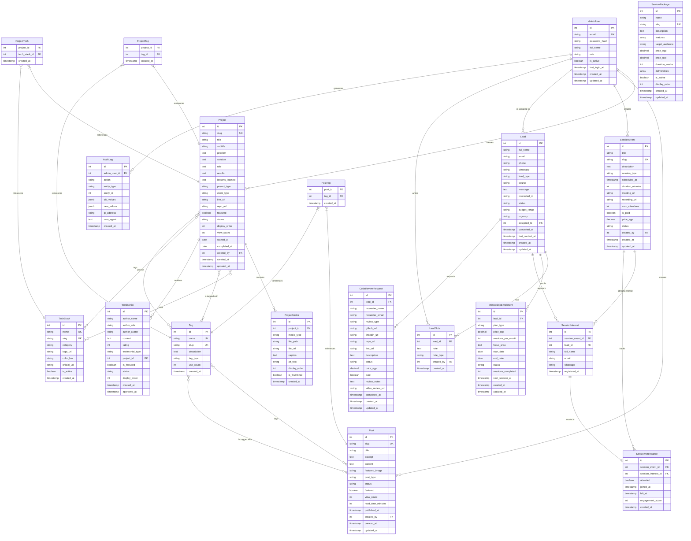

# Upgrade Lab - Complete ERD Design

## 1. Entities Overview

| Entity | Purpose |
|--------|---------|
| **AdminUser** | System administrators who manage the platform |
| **Project** | Portfolio projects/case studies showcasing work |
| **ProjectMedia** | Images and videos associated with projects |
| **TechStack** | Technology/framework catalog (React, Next.js, etc.) |
| **ProjectTech** | Junction table linking projects to technologies |
| **Tag** | Classification tags for content organization |
| **ProjectTag** | Junction table linking projects to tags |
| **Post** | Lab Notes blog posts and articles |
| **PostTag** | Junction table linking posts to tags |
| **Lead** | Potential students or clients who express interest |
| **LeadNote** | Follow-up notes and communication history for leads |
| **ServicePackage** | Predefined service offerings (MVP Sprint, Dashboard, etc.) |
| **SessionEvent** | Live sessions, workshops, and webinars |
| **SessionInterest** | Junction table tracking who's interested in sessions |
| **SessionAttendance** | Actual attendance records for sessions |
| **Testimonial** | Client/student reviews and social proof |
| **MentorshipEnrollment** | Active mentorship subscriptions |
| **CodeReviewRequest** | Paid code review requests from students |
| **AuditLog** | System activity tracking for security/compliance |

---

## 2. Entity Definitions

### AdminUser
```sql
CREATE TABLE admin_user (
    id SERIAL PRIMARY KEY,
    email VARCHAR(255) NOT NULL UNIQUE,
    password_hash VARCHAR(255) NOT NULL,
    full_name VARCHAR(255) NOT NULL,
    role VARCHAR(50) NOT NULL DEFAULT 'editor', -- 'super_admin', 'editor', 'viewer'
    is_active BOOLEAN NOT NULL DEFAULT true,
    last_login_at TIMESTAMP WITH TIME ZONE,
    created_at TIMESTAMP WITH TIME ZONE NOT NULL DEFAULT NOW(),
    updated_at TIMESTAMP WITH TIME ZONE NOT NULL DEFAULT NOW()
);

CREATE INDEX idx_admin_user_email ON admin_user(email);
CREATE INDEX idx_admin_user_role ON admin_user(role);
CREATE INDEX idx_admin_user_active ON admin_user(is_active);
```

**Fields:**
- `id`: Primary key, auto-increment
- `email`: Unique admin email, indexed for login
- `password_hash`: Bcrypt hashed password
- `full_name`: Display name
- `role`: Permission level (super_admin, editor, viewer)
- `is_active`: Soft delete flag
- `last_login_at`: Track last login for security
- `created_at`, `updated_at`: Audit timestamps

---

### Project
```sql
CREATE TABLE project (
    id SERIAL PRIMARY KEY,
    slug VARCHAR(255) NOT NULL UNIQUE,
    title VARCHAR(255) NOT NULL,
    subtitle VARCHAR(500),
    problem TEXT NOT NULL,
    solution TEXT NOT NULL,
    role TEXT NOT NULL,
    results TEXT,
    lessons_learned TEXT,
    project_type VARCHAR(50) NOT NULL, -- 'mvp', 'dashboard', 'landing', 'ui_upgrade', 'other'
    client_type VARCHAR(50) NOT NULL, -- 'student', 'business', 'personal', 'internal'
    live_url VARCHAR(500),
    repo_url VARCHAR(500),
    featured BOOLEAN NOT NULL DEFAULT false,
    status VARCHAR(50) NOT NULL DEFAULT 'published', -- 'draft', 'published', 'archived'
    display_order INTEGER NOT NULL DEFAULT 0,
    view_count INTEGER NOT NULL DEFAULT 0,
    started_at DATE,
    completed_at DATE,
    created_by INTEGER NOT NULL REFERENCES admin_user(id),
    created_at TIMESTAMP WITH TIME ZONE NOT NULL DEFAULT NOW(),
    updated_at TIMESTAMP WITH TIME ZONE NOT NULL DEFAULT NOW()
);

CREATE UNIQUE INDEX idx_project_slug ON project(slug);
CREATE INDEX idx_project_type ON project(project_type);
CREATE INDEX idx_project_featured ON project(featured) WHERE featured = true;
CREATE INDEX idx_project_status ON project(status);
CREATE INDEX idx_project_display_order ON project(display_order);
CREATE INDEX idx_project_created_by ON project(created_by);
```

**Fields:**
- `slug`: URL-friendly identifier for SEO
- `title`, `subtitle`: Project headings
- `problem`, `solution`, `role`, `results`, `lessons_learned`: Case study structure
- `project_type`: Categorization for filtering
- `client_type`: Who it was built for
- `live_url`, `repo_url`: External links
- `featured`: Homepage showcase flag
- `status`: Publication workflow
- `display_order`: Manual sorting
- `view_count`: Analytics tracking
- `started_at`, `completed_at`: Project timeline

---

### ProjectMedia
```sql
CREATE TABLE project_media (
    id SERIAL PRIMARY KEY,
    project_id INTEGER NOT NULL REFERENCES project(id) ON DELETE CASCADE,
    media_type VARCHAR(50) NOT NULL, -- 'image', 'video', 'gif'
    file_path VARCHAR(500) NOT NULL,
    file_url VARCHAR(500) NOT NULL,
    caption TEXT,
    alt_text VARCHAR(255),
    display_order INTEGER NOT NULL DEFAULT 0,
    is_thumbnail BOOLEAN NOT NULL DEFAULT false,
    created_at TIMESTAMP WITH TIME ZONE NOT NULL DEFAULT NOW()
);

CREATE INDEX idx_project_media_project ON project_media(project_id);
CREATE INDEX idx_project_media_thumbnail ON project_media(project_id, is_thumbnail) WHERE is_thumbnail = true;
CREATE INDEX idx_project_media_order ON project_media(project_id, display_order);
```

**Fields:**
- `project_id`: Foreign key to project
- `media_type`: File classification
- `file_path`: Server storage path
- `file_url`: CDN/public URL
- `caption`, `alt_text`: Accessibility and context
- `display_order`: Gallery sequence
- `is_thumbnail`: Main preview image flag

---

### TechStack
```sql
CREATE TABLE tech_stack (
    id SERIAL PRIMARY KEY,
    name VARCHAR(100) NOT NULL UNIQUE,
    slug VARCHAR(100) NOT NULL UNIQUE,
    category VARCHAR(50) NOT NULL, -- 'frontend', 'backend', 'database', 'devops', 'design', 'other'
    logo_url VARCHAR(500),
    color_hex VARCHAR(7), -- Brand color for UI badges
    official_url VARCHAR(500),
    is_active BOOLEAN NOT NULL DEFAULT true,
    created_at TIMESTAMP WITH TIME ZONE NOT NULL DEFAULT NOW()
);

CREATE UNIQUE INDEX idx_tech_stack_name ON tech_stack(name);
CREATE UNIQUE INDEX idx_tech_stack_slug ON tech_stack(slug);
CREATE INDEX idx_tech_stack_category ON tech_stack(category);
```

**Fields:**
- `name`: Technology name (e.g., "React", "PostgreSQL")
- `slug`: URL-friendly version
- `category`: Grouping for filters
- `logo_url`: Icon for badges
- `color_hex`: Brand color for UI consistency
- `is_active`: Hide deprecated tech

---

### ProjectTech (Junction)
```sql
CREATE TABLE project_tech (
    project_id INTEGER NOT NULL REFERENCES project(id) ON DELETE CASCADE,
    tech_stack_id INTEGER NOT NULL REFERENCES tech_stack(id) ON DELETE CASCADE,
    created_at TIMESTAMP WITH TIME ZONE NOT NULL DEFAULT NOW(),
    PRIMARY KEY (project_id, tech_stack_id)
);

CREATE INDEX idx_project_tech_project ON project_tech(project_id);
CREATE INDEX idx_project_tech_tech ON project_tech(tech_stack_id);
```

**Relationship:** Many-to-Many (Project ↔ TechStack)

---

### Tag
```sql
CREATE TABLE tag (
    id SERIAL PRIMARY KEY,
    name VARCHAR(100) NOT NULL UNIQUE,
    slug VARCHAR(100) NOT NULL UNIQUE,
    description TEXT,
    tag_type VARCHAR(50) NOT NULL DEFAULT 'general', -- 'general', 'topic', 'difficulty', 'format'
    use_count INTEGER NOT NULL DEFAULT 0,
    created_at TIMESTAMP WITH TIME ZONE NOT NULL DEFAULT NOW()
);

CREATE UNIQUE INDEX idx_tag_name ON tag(name);
CREATE UNIQUE INDEX idx_tag_slug ON tag(slug);
CREATE INDEX idx_tag_type ON tag(tag_type);
CREATE INDEX idx_tag_use_count ON tag(use_count DESC);
```

**Fields:**
- `name`, `slug`: Tag identification
- `tag_type`: Categorization for different uses
- `use_count`: Popularity metric for auto-complete

---

### ProjectTag (Junction)
```sql
CREATE TABLE project_tag (
    project_id INTEGER NOT NULL REFERENCES project(id) ON DELETE CASCADE,
    tag_id INTEGER NOT NULL REFERENCES tag(id) ON DELETE CASCADE,
    created_at TIMESTAMP WITH TIME ZONE NOT NULL DEFAULT NOW(),
    PRIMARY KEY (project_id, tag_id)
);

CREATE INDEX idx_project_tag_project ON project_tag(project_id);
CREATE INDEX idx_project_tag_tag ON project_tag(tag_id);
```

**Relationship:** Many-to-Many (Project ↔ Tag)

---

### Post
```sql
CREATE TABLE post (
    id SERIAL PRIMARY KEY,
    slug VARCHAR(255) NOT NULL UNIQUE,
    title VARCHAR(255) NOT NULL,
    excerpt TEXT,
    content TEXT NOT NULL,
    featured_image VARCHAR(500),
    post_type VARCHAR(50) NOT NULL DEFAULT 'article', -- 'article', 'session_summary', 'tutorial', 'announcement'
    status VARCHAR(50) NOT NULL DEFAULT 'draft', -- 'draft', 'published', 'archived'
    featured BOOLEAN NOT NULL DEFAULT false,
    view_count INTEGER NOT NULL DEFAULT 0,
    read_time_minutes INTEGER, -- Calculated on save
    published_at TIMESTAMP WITH TIME ZONE,
    created_by INTEGER NOT NULL REFERENCES admin_user(id),
    created_at TIMESTAMP WITH TIME ZONE NOT NULL DEFAULT NOW(),
    updated_at TIMESTAMP WITH TIME ZONE NOT NULL DEFAULT NOW()
);

CREATE UNIQUE INDEX idx_post_slug ON post(slug);
CREATE INDEX idx_post_status ON post(status);
CREATE INDEX idx_post_published_at ON post(published_at DESC) WHERE status = 'published';
CREATE INDEX idx_post_featured ON post(featured) WHERE featured = true;
CREATE INDEX idx_post_type ON post(post_type);
```

**Fields:**
- `slug`: SEO-friendly URL
- `title`, `excerpt`, `content`: Blog post structure
- `featured_image`: Header visual
- `post_type`: Content classification
- `status`: Publishing workflow
- `view_count`: Analytics
- `read_time_minutes`: Auto-calculated UX metric
- `published_at`: Separate from created_at for scheduling

---

### PostTag (Junction)
```sql
CREATE TABLE post_tag (
    post_id INTEGER NOT NULL REFERENCES post(id) ON DELETE CASCADE,
    tag_id INTEGER NOT NULL REFERENCES tag(id) ON DELETE CASCADE,
    created_at TIMESTAMP WITH TIME ZONE NOT NULL DEFAULT NOW(),
    PRIMARY KEY (post_id, tag_id)
);

CREATE INDEX idx_post_tag_post ON post_tag(post_id);
CREATE INDEX idx_post_tag_tag ON post_tag(tag_id);
```

**Relationship:** Many-to-Many (Post ↔ Tag)

---

### Lead
```sql
CREATE TABLE lead (
    id SERIAL PRIMARY KEY,
    full_name VARCHAR(255) NOT NULL,
    email VARCHAR(255),
    phone VARCHAR(50),
    whatsapp VARCHAR(50),
    lead_type VARCHAR(50) NOT NULL, -- 'student', 'client', 'partner', 'other'
    source VARCHAR(100) NOT NULL, -- 'website_form', 'whatsapp', 'instagram', 'facebook', 'referral', 'session'
    message TEXT,
    interested_in VARCHAR(100), -- 'mentorship', 'code_review', 'mvp_sprint', 'dashboard', 'landing_page', 'workshop'
    status VARCHAR(50) NOT NULL DEFAULT 'new', -- 'new', 'contacted', 'qualified', 'proposal_sent', 'closed_won', 'closed_lost', 'nurturing'
    budget_range VARCHAR(50),
    urgency VARCHAR(50), -- 'asap', 'this_month', 'next_month', 'exploring'
    assigned_to INTEGER REFERENCES admin_user(id),
    converted_at TIMESTAMP WITH TIME ZONE,
    last_contact_at TIMESTAMP WITH TIME ZONE,
    created_at TIMESTAMP WITH TIME ZONE NOT NULL DEFAULT NOW(),
    updated_at TIMESTAMP WITH TIME ZONE NOT NULL DEFAULT NOW()
);

CREATE INDEX idx_lead_email ON lead(email);
CREATE INDEX idx_lead_phone ON lead(phone);
CREATE INDEX idx_lead_type ON lead(lead_type);
CREATE INDEX idx_lead_status ON lead(status);
CREATE INDEX idx_lead_source ON lead(source);
CREATE INDEX idx_lead_assigned ON lead(assigned_to);
CREATE INDEX idx_lead_created ON lead(created_at DESC);
```

**Fields:**
- `full_name`, `email`, `phone`, `whatsapp`: Contact info
- `lead_type`: Segment classification
- `source`: Attribution tracking
- `message`: Initial inquiry
- `interested_in`: Service/product interest
- `status`: Sales pipeline stage
- `budget_range`, `urgency`: Qualification fields
- `assigned_to`: CRM ownership
- `converted_at`: Conversion tracking
- `last_contact_at`: Follow-up reminder

---

### LeadNote
```sql
CREATE TABLE lead_note (
    id SERIAL PRIMARY KEY,
    lead_id INTEGER NOT NULL REFERENCES lead(id) ON DELETE CASCADE,
    note TEXT NOT NULL,
    note_type VARCHAR(50) NOT NULL DEFAULT 'general', -- 'general', 'call', 'email', 'meeting', 'whatsapp'
    created_by INTEGER NOT NULL REFERENCES admin_user(id),
    created_at TIMESTAMP WITH TIME ZONE NOT NULL DEFAULT NOW()
);

CREATE INDEX idx_lead_note_lead ON lead_note(lead_id);
CREATE INDEX idx_lead_note_created ON lead_note(created_at DESC);
```

**Relationship:** One-to-Many (Lead → LeadNote)

---

### ServicePackage
```sql
CREATE TABLE service_package (
    id SERIAL PRIMARY KEY,
    name VARCHAR(255) NOT NULL,
    slug VARCHAR(255) NOT NULL UNIQUE,
    description TEXT NOT NULL,
    features TEXT[], -- PostgreSQL array: ['Feature 1', 'Feature 2']
    target_audience VARCHAR(50) NOT NULL, -- 'student', 'client', 'both'
    price_egp DECIMAL(10, 2),
    price_usd DECIMAL(10, 2),
    duration_weeks INTEGER,
    deliverables TEXT[],
    is_active BOOLEAN NOT NULL DEFAULT true,
    display_order INTEGER NOT NULL DEFAULT 0,
    created_at TIMESTAMP WITH TIME ZONE NOT NULL DEFAULT NOW(),
    updated_at TIMESTAMP WITH TIME ZONE NOT NULL DEFAULT NOW()
);

CREATE UNIQUE INDEX idx_service_package_slug ON service_package(slug);
CREATE INDEX idx_service_package_target ON service_package(target_audience);
CREATE INDEX idx_service_package_active ON service_package(is_active) WHERE is_active = true;
```

**Fields:**
- `features`, `deliverables`: PostgreSQL arrays for structured data
- `target_audience`: Student vs client services
- `price_egp`, `price_usd`: Multi-currency support
- `duration_weeks`: Timeline estimation

---

### SessionEvent
```sql
CREATE TABLE session_event (
    id SERIAL PRIMARY KEY,
    title VARCHAR(255) NOT NULL,
    slug VARCHAR(255) NOT NULL UNIQUE,
    description TEXT NOT NULL,
    session_type VARCHAR(50) NOT NULL, -- 'weekly_live', 'workshop', 'code_review', 'Q&A', 'masterclass'
    scheduled_at TIMESTAMP WITH TIME ZONE NOT NULL,
    duration_minutes INTEGER NOT NULL DEFAULT 60,
    meeting_url VARCHAR(500),
    recording_url VARCHAR(500),
    max_attendees INTEGER,
    is_paid BOOLEAN NOT NULL DEFAULT false,
    price_egp DECIMAL(10, 2),
    status VARCHAR(50) NOT NULL DEFAULT 'scheduled', -- 'scheduled', 'live', 'completed', 'cancelled'
    created_by INTEGER NOT NULL REFERENCES admin_user(id),
    created_at TIMESTAMP WITH TIME ZONE NOT NULL DEFAULT NOW(),
    updated_at TIMESTAMP WITH TIME ZONE NOT NULL DEFAULT NOW()
);

CREATE UNIQUE INDEX idx_session_event_slug ON session_event(slug);
CREATE INDEX idx_session_event_scheduled ON session_event(scheduled_at);
CREATE INDEX idx_session_event_status ON session_event(status);
CREATE INDEX idx_session_event_type ON session_event(session_type);
```

**Fields:**
- `scheduled_at`: Event date/time
- `duration_minutes`: Session length
- `meeting_url`: Zoom/Google Meet link
- `recording_url`: Post-session replay
- `max_attendees`: Capacity limit
- `is_paid`: Monetization flag

---

### SessionInterest (Junction)
```sql
CREATE TABLE session_interest (
    id SERIAL PRIMARY KEY,
    session_event_id INTEGER NOT NULL REFERENCES session_event(id) ON DELETE CASCADE,
    lead_id INTEGER REFERENCES lead(id) ON DELETE SET NULL,
    full_name VARCHAR(255) NOT NULL,
    email VARCHAR(255),
    whatsapp VARCHAR(50),
    registered_at TIMESTAMP WITH TIME ZONE NOT NULL DEFAULT NOW()
);

CREATE INDEX idx_session_interest_session ON session_interest(session_event_id);
CREATE INDEX idx_session_interest_lead ON session_interest(lead_id);
CREATE INDEX idx_session_interest_registered ON session_interest(registered_at);
```

**Relationship:** Many-to-Many (SessionEvent ↔ Lead/Guest)

---

### SessionAttendance
```sql
CREATE TABLE session_attendance (
    id SERIAL PRIMARY KEY,
    session_event_id INTEGER NOT NULL REFERENCES session_event(id) ON DELETE CASCADE,
    session_interest_id INTEGER NOT NULL REFERENCES session_interest(id) ON DELETE CASCADE,
    attended BOOLEAN NOT NULL DEFAULT false,
    joined_at TIMESTAMP WITH TIME ZONE,
    left_at TIMESTAMP WITH TIME ZONE,
    engagement_score INTEGER CHECK (engagement_score >= 1 AND engagement_score <= 5),
    created_at TIMESTAMP WITH TIME ZONE NOT NULL DEFAULT NOW(),
    UNIQUE(session_event_id, session_interest_id)
);

CREATE INDEX idx_session_attendance_session ON session_attendance(session_event_id);
CREATE INDEX idx_session_attendance_interest ON session_attendance(session_interest_id);
CREATE INDEX idx_session_attendance_attended ON session_attendance(attended);
```

**Relationship:** One-to-One (SessionInterest → SessionAttendance)

---

### Testimonial
```sql
CREATE TABLE testimonial (
    id SERIAL PRIMARY KEY,
    author_name VARCHAR(255) NOT NULL,
    author_role VARCHAR(255), -- 'Student', 'Founder at XYZ', etc.
    author_avatar VARCHAR(500),
    content TEXT NOT NULL,
    rating INTEGER CHECK (rating >= 1 AND rating <= 5),
    testimonial_type VARCHAR(50) NOT NULL, -- 'student', 'client', 'partner'
    project_id INTEGER REFERENCES project(id) ON DELETE SET NULL,
    is_featured BOOLEAN NOT NULL DEFAULT false,
    status VARCHAR(50) NOT NULL DEFAULT 'pending', -- 'pending', 'approved', 'rejected'
    display_order INTEGER NOT NULL DEFAULT 0,
    created_at TIMESTAMP WITH TIME ZONE NOT NULL DEFAULT NOW(),
    approved_at TIMESTAMP WITH TIME ZONE
);

CREATE INDEX idx_testimonial_type ON testimonial(testimonial_type);
CREATE INDEX idx_testimonial_featured ON testimonial(is_featured) WHERE is_featured = true;
CREATE INDEX idx_testimonial_status ON testimonial(status);
CREATE INDEX idx_testimonial_project ON testimonial(project_id);
```

**Fields:**
- `author_name`, `author_role`, `author_avatar`: Attribution
- `content`: Testimonial text
- `rating`: 1-5 stars
- `project_id`: Optional link to specific project
- `is_featured`: Homepage display
- `status`: Moderation workflow

---

### MentorshipEnrollment
```sql
CREATE TABLE mentorship_enrollment (
    id SERIAL PRIMARY KEY,
    lead_id INTEGER NOT NULL REFERENCES lead(id) ON DELETE CASCADE,
    plan_type VARCHAR(50) NOT NULL, -- 'weekly', 'monthly', 'custom'
    price_egp DECIMAL(10, 2) NOT NULL,
    sessions_per_month INTEGER NOT NULL,
    focus_area TEXT, -- 'Frontend', 'Backend', 'Full-stack', 'Career transition'
    start_date DATE NOT NULL,
    end_date DATE,
    status VARCHAR(50) NOT NULL DEFAULT 'active', -- 'active', 'paused', 'completed', 'cancelled'
    sessions_completed INTEGER NOT NULL DEFAULT 0,
    next_session_at TIMESTAMP WITH TIME ZONE,
    created_at TIMESTAMP WITH TIME ZONE NOT NULL DEFAULT NOW(),
    updated_at TIMESTAMP WITH TIME ZONE NOT NULL DEFAULT NOW()
);

CREATE INDEX idx_mentorship_enrollment_lead ON mentorship_enrollment(lead_id);
CREATE INDEX idx_mentorship_enrollment_status ON mentorship_enrollment(status);
CREATE INDEX idx_mentorship_enrollment_next_session ON mentorship_enrollment(next_session_at) WHERE status = 'active';
```

**Relationship:** One-to-Many (Lead → MentorshipEnrollment)

---

### CodeReviewRequest
```sql
CREATE TABLE code_review_request (
    id SERIAL PRIMARY KEY,
    lead_id INTEGER REFERENCES lead(id) ON DELETE SET NULL,
    requester_name VARCHAR(255) NOT NULL,
    requester_email VARCHAR(255) NOT NULL,
    review_type VARCHAR(50) NOT NULL, -- 'github_profile', 'linkedin_profile', 'project_code', 'ui_review'
    github_url VARCHAR(500),
    linkedin_url VARCHAR(500),
    repo_url VARCHAR(500),
    live_url VARCHAR(500),
    description TEXT,
    status VARCHAR(50) NOT NULL DEFAULT 'pending', -- 'pending', 'in_review', 'completed', 'cancelled'
    price_egp DECIMAL(10, 2),
    paid BOOLEAN NOT NULL DEFAULT false,
    review_notes TEXT,
    video_review_url VARCHAR(500),
    completed_at TIMESTAMP WITH TIME ZONE,
    created_at TIMESTAMP WITH TIME ZONE NOT NULL DEFAULT NOW(),
    updated_at TIMESTAMP WITH TIME ZONE NOT NULL DEFAULT NOW()
);

CREATE INDEX idx_code_review_request_lead ON code_review_request(lead_id);
CREATE INDEX idx_code_review_request_status ON code_review_request(status);
CREATE INDEX idx_code_review_request_paid ON code_review_request(paid);
CREATE INDEX idx_code_review_request_created ON code_review_request(created_at DESC);
```

**Fields:**
- `review_type`: Different review offerings
- `github_url`, `linkedin_url`, `repo_url`, `live_url`: Review targets
- `paid`: Payment confirmation
- `review_notes`, `video_review_url`: Deliverables

---

### AuditLog
```sql
CREATE TABLE audit_log (
    id SERIAL PRIMARY KEY,
    admin_user_id INTEGER REFERENCES admin_user(id) ON DELETE SET NULL,
    action VARCHAR(100) NOT NULL, -- 'create', 'update', 'delete', 'login', 'logout'
    entity_type VARCHAR(100), -- 'project', 'post', 'lead', etc.
    entity_id INTEGER,
    old_values JSONB,
    new_values JSONB,
    ip_address VARCHAR(45),
    user_agent TEXT,
    created_at TIMESTAMP WITH TIME ZONE NOT NULL DEFAULT NOW()
);

CREATE INDEX idx_audit_log_admin ON audit_log(admin_user_id);
CREATE INDEX idx_audit_log_action ON audit_log(action);
CREATE INDEX idx_audit_log_entity ON audit_log(entity_type, entity_id);
CREATE INDEX idx_audit_log_created ON audit_log(created_at DESC);
```

**Fields:**
- `old_values`, `new_values`: JSONB for flexible change tracking
- `ip_address`, `user_agent`: Security auditing

---

## 3. Relationships Summary

### One-to-Many (1:M)

1. **AdminUser → Project** (1:M)
   - One admin creates many projects
   - `project.created_by` → `admin_user.id`

2. **AdminUser → Post** (1:M)
   - One admin creates many posts
   - `post.created_by` → `admin_user.id`

3. **AdminUser → SessionEvent** (1:M)
   - One admin creates many sessions
   - `session_event.created_by` → `admin_user.id`

4. **AdminUser → Lead** (1:M - Optional)
   - One admin handles many leads
   - `lead.assigned_to` → `admin_user.id`

5. **Project → ProjectMedia** (1:M)
   - One project has many media files
   - `project_media.project_id` → `project.id`
   - CASCADE DELETE: Delete media when project is deleted

6. **Lead → LeadNote** (1:M)
   - One lead has many follow-up notes
   - `lead_note.lead_id` → `lead.id`
   - CASCADE DELETE

7. **Lead → MentorshipEnrollment** (1:M)
   - One lead can have multiple mentorship periods
   - `mentorship_enrollment.lead_id` → `lead.id`
   - CASCADE DELETE

8. **AdminUser → LeadNote** (1:M)
   - One admin writes many notes
   - `lead_note.created_by` → `admin_user.id`

9. **SessionEvent → SessionInterest** (1:M)
   - One session has many interested attendees
   - `session_interest.session_event_id` → `session_event.id`
   - CASCADE DELETE

10. **Lead → SessionInterest** (1:M - Optional)
    - One lead can register for many sessions
    - `session_interest.lead_id` → `lead.id`
    - SET NULL: Keep registration even if lead is deleted

11. **SessionEvent → SessionAttendance** (1:M)
    - One session has many attendance records
    - `session_attendance.session_event_id` → `session_event.id`
    - CASCADE DELETE

12. **SessionInterest → SessionAttendance** (1:1)
    - Each registration has one attendance record
    - `session_attendance.session_interest_id` → `session_interest.id`
    - CASCADE DELETE
    - UNIQUE constraint ensures 1:1

13. **Project → Testimonial** (1:M - Optional)
    - One project can have many testimonials
    - `testimonial.project_id` → `project.id`
    - SET NULL: Keep testimonial even if project is deleted

14. **Lead → CodeReviewRequest** (1:M - Optional)
    - One lead can request multiple code reviews
    - `code_review_request.lead_id` → `lead.id`
    - SET NULL

15. **AdminUser → AuditLog** (1:M - Optional)
    - One admin generates many audit entries
    - `audit_log.admin_user_id` → `admin_user.id`
    - SET NULL: Keep audit trail even if admin is deleted

### Many-to-Many (M:M)

1. **Project ↔ TechStack** (M:M)
   - Junction: `project_tech`
   - One project uses many technologies
   - One technology is used in many projects

2. **Project ↔ Tag** (M:M)
   - Junction: `project_tag`
   - One project has many tags
   - One tag applies to many projects

3. **Post ↔ Tag** (M:M)
   - Junction: `post_tag`
   - One post has many tags
   - One tag applies to many posts

---

## 4. Business Rules

1. **BR-01: Email Uniqueness**
   - Admin emails must be unique across the system
   - Constraint: `UNIQUE(admin_user.email)`

2. **BR-02: Slug Uniqueness**
   - All slugs (projects, posts, services, sessions) must be globally unique within their entity type
   - Constraints: `UNIQUE(project.slug)`, `UNIQUE(post.slug)`, etc.

3. **BR-03: Featured Project Limit**
   - Maximum 6 featured projects can be displayed on homepage
   - Enforcement: Application logic + indexed query for performance

4. **BR-04: One Thumbnail Per Project**
   - Each project must have exactly one thumbnail image
   - Enforcement: Application logic validates `is_thumbnail` flag

5. **BR-05: Lead Contact Requirement**
   - Every lead must have at least one contact method (email OR phone OR whatsapp)
   - Enforcement: Application validation before insert

6. **BR-06: Status Workflow**
   - Lead status transitions must follow valid paths:
     - `new → contacted → qualified → proposal_sent → closed_won/closed_lost`
     - `new → contacted → nurturing`
   - Enforcement: Application state machine

7. **BR-07: Published Content Requires Timestamp**
   - Posts with `status='published'` must have `published_at` set
   - Projects with `status='published'` must have `completed_at` set
   - Enforcement: Application validation + database CHECK constraint (optional)

8. **BR-08: Session Capacity**
   - `SessionInterest` count for a session cannot exceed `session_event.max_attendees` (if set)
   - Enforcement: Application transaction lock before registration

9. **BR-09: Attendance Requires Registration**
   - `SessionAttendance` can only exist if `SessionInterest` exists first
   - Enforcement: Foreign key constraint + application logic

10. **BR-10: Rating Range**
    - Testimonial ratings must be between 1 and 5
    - Constraint: `CHECK (testimonial.rating >= 1 AND testimonial.rating <= 5)`

11. **BR-11: Engagement Score Range**
    - Session engagement scores must be between 1 and 5
    - Constraint: `CHECK (session_attendance.engagement_score >= 1 AND engagement_score <= 5)`

12. **BR-12: Cascade Deletion Protection**
    - Deleting a Project cascades to ProjectMedia, ProjectTech, ProjectTag
    - Deleting a Lead cascades to LeadNote, MentorshipEnrollment
    - Deleting a SessionEvent cascades to SessionInterest and SessionAttendance
    - Enforcement: `ON DELETE CASCADE` foreign keys

13. **BR-13: Soft Delete for Critical Entities**
    - AdminUser uses `is_active` flag instead of hard delete
    - Lead, Project, Post can be archived via `status` field
    - Enforcement: Application never DELETEs, only UPDATEs status

14. **BR-14: Auto-Update Timestamps**
    - `updated_at` must be refreshed on every UPDATE
    - Enforcement: PostgreSQL trigger or application ORM hook

15. **BR-15: Tag Use Count Sync**
    - `tag.use_count` must equal actual usage in junction tables
    - Enforcement: Database trigger on INSERT/DELETE in `project_tag` and `post_tag`

---

## 5. Example Records (JSON)

### Project Examples

```json
[
  {
    "id": 1,
    "slug": "saas-dashboard-rebuild",
    "title": "SaaS Analytics Dashboard",
    "subtitle": "Real-time metrics dashboard for 10K+ users",
    "problem": "Client had a slow, cluttered admin panel built with jQuery. Users complained about load times and confusing navigation.",
    "solution": "Rebuilt the entire dashboard using Next.js 14, shadcn/ui, and Recharts. Implemented virtualized tables for large datasets, optimistic UI updates, and dark mode.",
    "role": "Full-stack developer - UI/UX design, frontend architecture, API integration",
    "results": "Page load time reduced from 4.2s to 0.8s. User satisfaction score increased from 3.1 to 4.7/5. Client reported 40% reduction in support tickets.",
    "lessons_learned": "Always profile before optimizing. The real bottleneck was unoptimized SQL queries, not React rendering.",
    "project_type": "dashboard",
    "client_type": "business",
    "live_url": "https://demo.example.com",
    "repo_url": null,
    "featured": true,
    "status": "published",
    "display_order": 1,
    "view_count": 247,
    "started_at": "2025-11-15",
    "completed_at": "2026-01-20",
    "created_by": 1,
    "created_at": "2026-01-21T10:30:00Z",
    "updated_at": "2026-02-01T14:22:00Z"
  },
  {
    "id": 2,
    "slug": "fitness-tracker-mvp",
    "title": "FitTrack - Workout Logger MVP",
    "subtitle": "Mobile-first workout tracking for gym enthusiasts",
    "problem": "Student wanted to build a portfolio project but struggled with scope creep and incomplete features.",
    "solution": "Guided them through MVP planning: authentication, exercise library, workout logging, and basic progress charts. Built with React, Supabase, and TailwindCSS.",
    "role": "Mentor & code reviewer - provided weekly feedback, architecture guidance, and deployment help",
    "results": "Student completed their first full-stack project in 6 weeks. Successfully landed their first freelance client using this portfolio piece.",
    "lessons_learned": "Ruthless prioritization is the key to finishing projects. 'Perfect' is the enemy of 'shipped'.",
    "project_type": "mvp",
    "client_type": "student",
    "live_url": "https://fittrack-demo.vercel.app",
    "repo_url": "https://github.com/student/fittrack",
    "featured": true,
    "status": "published",
    "display_order": 2,
    "view_count": 189,
    "started_at": "2025-12-01",
    "completed_at": "2026-01-15",
    "created_by": 1,
    "created_at": "2026-01-16T09:15:00Z",
    "updated_at": "2026-01-16T09:15:00Z"
  },
  {
    "id": 3,
    "slug": "restaurant-landing-premium",
    "title": "Bella Cucina Landing Page",
    "subtitle": "Premium restaurant website with online reservations",
    "problem": "Restaurant owner had a basic WordPress site with broken plugins and poor mobile experience. Losing customers to competitors with better online presence.",
    "solution": "Designed and built a stunning landing page with hero video, menu showcase, Google Maps integration, and Calendly-powered reservation system. Optimized for Core Web Vitals.",
    "role": "Designer & developer - full project ownership from wireframes to deployment",
    "results": "Lighthouse score: 98/100. Online reservations increased by 160% in first month. Client received multiple compliments from customers about the website.",
    "lessons_learned": "Performance matters. Optimized images and lazy loading made a huge difference on 3G connections.",
    "project_type": "landing",
    "client_type": "business",
    "live_url": "https://bellacucina.example.com",
    "repo_url": null,
    "featured": false,
    "status": "published",
    "display_order": 3,
    "view_count": 132,
    "started_at": "2026-01-05",
    "completed_at": "2026-01-28",
    "created_by": 1,
    "created_at": "2026-01-29T11:00:00Z",
    "updated_at": "2026-02-02T16:45:00Z"
  }
]
```

---

### Lead Examples

```json
[
  {
    "id": 101,
    "full_name": "Ahmed Hassan",
    "email": "ahmed.hassan@gmail.com",
    "phone": "+201012345678",
    "whatsapp": "+201012345678",
    "lead_type": "student",
    "source": "instagram",
    "message": "السلام عليكم، شفت السيشن بتاعك عن Roadmap للـ Frontend. أنا خريج حديث وعايز أبدأ صح. ممكن أعرف تفاصيل الـ Mentorship؟",
    "interested_in": "mentorship",
    "status": "contacted",
    "budget_range": "500-1000 EGP/month",
    "urgency": "this_month",
    "assigned_to": 1,
    "converted_at": null,
    "last_contact_at": "2026-02-03T10:30:00Z",
    "created_at": "2026-02-01T14:22:00Z",
    "updated_at": "2026-02-03T10:30:00Z"
  },
  {
    "id": 102,
    "full_name": "Sara Mohamed",
    "email": "sara.startup@gmail.com",
    "phone": null,
    "whatsapp": "+201098765432",
    "lead_type": "client",
    "source": "website_form",
    "message": "We're launching a B2B SaaS product and need an MVP dashboard. Need user management, billing integration, and analytics. Timeline: 6-8 weeks.",
    "interested_in": "mvp_sprint",
    "status": "proposal_sent",
    "budget_range": "15000-25000 EGP",
    "urgency": "asap",
    "assigned_to": 1,
    "converted_at": null,
    "last_contact_at": "2026-02-04T09:00:00Z",
    "created_at": "2026-01-28T16:45:00Z",
    "updated_at": "2026-02-04T09:00:00Z"
  },
  {
    "id": 103,
    "full_name": "Omar Khaled",
    "email": "omar.dev@outlook.com",
    "phone": "+201055555555",
    "whatsapp": "+201055555555",
    "lead_type": "student",
    "source": "session",
    "message": "Attended your 'Build in Public' session yesterday. Want code review for my GitHub profile and portfolio site before applying to jobs.",
    "interested_in": "code_review",
    "status": "qualified",
    "budget_range": "300-500 EGP",
    "urgency": "this_month",
    "assigned_to": 1,
    "converted_at": null,
    "last_contact_at": "2026-02-04T11:15:00Z",
    "created_at": "2026-02-03T19:30:00Z",
    "updated_at": "2026-02-04T11:15:00Z"
  }
]
```

---

### SessionEvent Examples

```json
[
  {
    "id": 201,
    "title": "Upgrade Lab Live: Start & Ship - Week 12",
    "slug": "upgrade-lab-live-week-12",
    "description": "This week: Building a production-ready authentication system with Next.js 14 and Supabase. We'll cover email/password, OAuth, protected routes, and session management. Live coding + Q&A.",
    "session_type": "weekly_live",
    "scheduled_at": "2026-02-07T19:00:00Z",
    "duration_minutes": 60,
    "meeting_url": "https://meet.google.com/xyz-abc-def",
    "recording_url": null,
    "max_attendees": 100,
    "is_paid": false,
    "price_egp": null,
    "status": "scheduled",
    "created_by": 1,
    "created_at": "2026-01-31T10:00:00Z",
    "updated_at": "2026-01-31T10:00:00Z"
  },
  {
    "id": 202,
    "title": "Masterclass: From Idea to Deployed MVP in 30 Days",
    "slug": "idea-to-mvp-30-days",
    "description": "Intensive workshop covering: idea validation, scope definition, tech stack selection, MVP planning, rapid development techniques, and deployment. Includes 4 weekly sessions + code reviews.",
    "session_type": "masterclass",
    "scheduled_at": "2026-02-15T18:00:00Z",
    "duration_minutes": 120,
    "meeting_url": "https://zoom.us/j/123456789",
    "recording_url": null,
    "max_attendees": 25,
    "is_paid": true,
    "price_egp": 1500.00,
    "status": "scheduled",
    "created_by": 1,
    "created_at": "2026-02-01T12:00:00Z",
    "updated_at": "2026-02-01T12:00:00Z"
  },
  {
    "id": 203,
    "title": "Upgrade Lab Live: AI for Developers - No Hype, Real Tools",
    "slug": "ai-for-developers-real-tools",
    "description": "Completed session on practical AI tools for developers. Covered: GitHub Copilot best practices, ChatGPT for debugging, AI-assisted testing, and when NOT to use AI.",
    "session_type": "weekly_live",
    "scheduled_at": "2026-01-31T19:00:00Z",
    "duration_minutes": 60,
    "meeting_url": "https://meet.google.com/old-session",
    "recording_url": "https://youtube.com/watch?v=dQw4w9WgXcQ",
    "max_attendees": 100,
    "is_paid": false,
    "price_egp": null,
    "status": "completed",
    "created_by": 1,
    "created_at": "2026-01-24T10:00:00Z",
    "updated_at": "2026-02-01T08:30:00Z"
  }
]
```

---

## 6. Mermaid ER Diagram



---

## 7. Implementation Notes

### Indexes Strategy
- **Primary Keys**: Auto-indexed
- **Foreign Keys**: Always indexed for JOIN performance
- **Unique Constraints**: Indexed for uniqueness enforcement
- **Query Optimization**: Indexes on frequently filtered columns (status, type, dates)
- **Partial Indexes**: For boolean flags (`WHERE is_active = true`)

### Data Types
- **Timestamps**: Always `TIMESTAMP WITH TIME ZONE` for global compatibility
- **Money**: `DECIMAL(10, 2)` for precision (no floating point errors)
- **Arrays**: PostgreSQL native arrays for lists (`TEXT[]`)
- **JSON**: `JSONB` for flexible schema (audit logs, metadata)

### Performance Considerations
1. **Cascading Deletes**: Carefully designed to maintain referential integrity
2. **Soft Deletes**: Critical entities use status flags instead of DELETE
3. **Counter Caches**: `tag.use_count`, `project.view_count` for denormalized reads
4. **Partial Indexes**: Reduce index size for common queries

### Security
1. **Password Hashing**: Use bcrypt with salt rounds ≥ 12
2. **Audit Trail**: All admin actions logged in `audit_log`
3. **Soft Delete**: Preserve data for compliance/recovery
4. **Input Validation**: Enforce constraints at database + application layer

### Scalability
1. **Pagination**: All list queries use `LIMIT/OFFSET` or cursor-based
2. **Connection Pooling**: Use PgBouncer for high concurrency
3. **Read Replicas**: Separate read-heavy queries (public site) from writes (admin)
4. **Caching**: Redis for frequently accessed data (featured projects, session list)

---

## 8. PostgreSQL vs Alternatives

**Recommendation: PostgreSQL ✅**

### Why PostgreSQL is Perfect Here:
1. **Rich Data Types**: JSONB for audit logs, Arrays for features/deliverables
2. **Full-Text Search**: Built-in support for searching projects/posts
3. **Mature Ecosystem**: Excellent ORMs (Prisma, TypeORM, SQLAlchemy)
4. **Performance**: Handles complex JOINs efficiently
5. **Free & Open Source**: No licensing costs
6. **Scalability**: Proven at massive scale (Instagram, Notion, Discord)

### When to Consider Alternatives:
- **MongoDB**: If you need extreme schema flexibility (not applicable here - structured data)
- **MySQL**: If you're already in that ecosystem (PostgreSQL is superior for this use case)
- **Supabase**: PostgreSQL + real-time + auth + storage (great for rapid prototyping!)

**Final Verdict**: Stick with PostgreSQL. It's the best choice for this project.

---

## Next Steps

1. **Database Setup**:
   ```bash
   # Create PostgreSQL database
   createdb upgrade_lab_db
   
   # Run migrations (use Prisma/Drizzle/raw SQL)
   psql upgrade_lab_db < schema.sql
   ```

2. **Seed Data**:
   - Create initial AdminUser
   - Populate TechStack catalog (React, Next.js, TypeScript, etc.)
   - Create sample Tags (Frontend, Backend, Tutorial, etc.)

3. **Application Layer**:
   - Choose ORM (Prisma recommended for TypeScript)
   - Implement business rules in application logic
   - Set up automated testing for critical workflows

4. **Admin Panel**:
   - Build CRUD interfaces for all entities
   - Dashboard with KPIs (leads/week, sessions, conversions)
   - Analytics integration (view counts, traffic sources)

5. **Public API**:
   - Read-only endpoints for website (projects, posts, sessions)
   - Lead submission endpoint with rate limiting
   - Session registration with capacity validation
