# Upgrade Lab - Complete Implementation Plan

## Executive Summary

**Project**: Upgrade Lab - Execution-first programming brand with portfolio + CRM + learning platform  
**Timeline**: 8-12 weeks to production MVP  
**Stack**: Next.js 14 + Fastify + PostgreSQL + Prisma + Redis  
**Team Size**: 1-2 developers (can be solo)  
**Business Model**: Services (MVP sprints, mentorship, code reviews) + Content (portfolio, blog)

---

## 1. System Modules

### Architecture Overview


---

### Module Breakdown

#### Module 1: Public Website (Next.js App Router)
**Purpose**: Showcase portfolio, content, and services to potential clients/students

**Key Features**:
- Homepage with featured projects
- Portfolio/Work page with filters
- Case study detail pages
- Blog (Lab Notes)
- Services page
- Session events list + registration
- Contact/Lead submission form
- About page

**Tech Stack**:
- Next.js 14 (App Router)
- Server Components for performance
- shadcn/ui for components
- TailwindCSS for styling
- Framer Motion for animations
- React Query for data fetching

**Hosting**: Vercel (ideal for Next.js)

---

#### Module 2: Admin Panel (Next.js App Router)
**Purpose**: Content management and CRM for admins

**Key Features**:
- Dashboard with KPIs
- Project CRUD
- Post/Blog CRUD (with markdown editor)
- Lead CRM (list, detail, notes, status updates)
- Session management
- Code review requests
- Testimonial approval
- Media library
- Analytics overview

**Tech Stack**:
- Next.js 14 (App Router)
- shadcn/ui + custom admin components
- React Hook Form + Zod validation
- React Query for API integration
- TipTap or SimpleMDE for markdown editing

**Hosting**: Vercel (same monorepo as public site)

---

#### Module 3: Backend API (Fastify)
**Purpose**: Business logic, data access, authentication

**Key Features**:
- RESTful API (50+ endpoints)
- JWT authentication + refresh tokens
- Role-based authorization
- Input validation (Zod)
- Rate limiting (Redis)
- File upload handling
- Email sending
- Audit logging

**Tech Stack**:
- Fastify (fast, TypeScript-first)
- Prisma ORM
- jose for JWT
- bcrypt for passwords
- Zod for validation
- Multer for file uploads

**Hosting**: Railway, Render, or DigitalOcean App Platform

---

#### Module 4: Database (PostgreSQL)
**Purpose**: Persistent data storage

**Schema**: 20 tables (see ERD document)

**Hosting**: 
- Railway Postgres (easy, free tier)
- Supabase (PostgreSQL + extras)
- DigitalOcean Managed Database

**Backup Strategy**: Daily automated backups + weekly full backup retention

---

#### Module 5: Cache & Sessions (Redis)
**Purpose**: Performance optimization and rate limiting

**Use Cases**:
- API rate limiting
- Session storage
- Cache for frequently accessed data (featured projects, session list)
- Job queue (future: email sending)

**Hosting**: Upstash Redis (serverless, free tier)

---

#### Module 6: Media Storage (S3/Cloudinary)
**Purpose**: Images, videos, file uploads

**Strategy**:
- Cloudinary for images (auto-optimization, transformations)
- S3 for large files (video recordings, downloadables)

**Optimization**:
- Next.js Image component for lazy loading
- WebP format with fallbacks
- Responsive images

---

#### Module 7: Email Service
**Purpose**: Transactional emails

**Use Cases**:
- New lead notification (to admin)
- Session registration confirmation
- Code review request received
- Session reminder (1 hour before)
- Mentorship welcome email

**Provider**: Resend (modern, great DX) or SendGrid (established)

---

#### Module 8: Analytics
**Purpose**: Privacy-friendly usage tracking

**Metrics**:
- Page views
- Lead submissions
- Session registrations
- Conversion funnel
- Traffic sources

**Provider**: Plausible or Umami (self-hosted, GDPR compliant)

---

## 2. Data Flow & User Journeys

### 2.1 User Journey: Student Discovers Upgrade Lab

```mermaid
sequenceDiagram
    participant S as Student
    participant WEB as Public Website
    participant API as Backend API
    participant DB as Database
    participant EMAIL as Email Service

    S->>WEB: Sees Instagram post → Clicks link
    WEB->>API: GET /projects (with filters)
    API->>DB: Query projects
    DB-->>API: Return projects
    API-->>WEB: JSON response
    WEB->>S: Display portfolio grid
    
    S->>WEB: Clicks case study
    WEB->>API: GET /projects/:slug
    API->>DB: Query project + media + tech
    DB-->>API: Full project data
    API-->>WEB: JSON response
    WEB->>S: Display case study
    
    S->>WEB: Impressed → Clicks "تواصل معانا"
    WEB->>S: Show lead form modal
    S->>WEB: Fills form (name, email, "interested in mentorship")
    WEB->>API: POST /leads
    API->>DB: INSERT lead record (status: new)
    API->>EMAIL: Send notification to admin
    API-->>WEB: Success response
    WEB->>S: Show thank you message
    
    Note over S,EMAIL: Admin contacts student within 24h
```



---

### 2.2 User Journey: Client Requests MVP Sprint

```mermaid
sequenceDiagram
    participant C as Client
    participant WEB as Public Website
    participant API as Backend API
    participant DB as Database
    participant ADMIN as Admin/Mohamed

    C->>WEB: Google search → Lands on homepage
    WEB->>API: GET /projects?type=mvp
    API->>DB: Query MVP projects
    DB-->>API: MVP case studies
    API-->>WEB: JSON response
    WEB->>C: Display MVP projects
    
    C->>WEB: Clicks "Services" → MVP Sprint
    WEB->>API: GET /services/mvp-sprint
    API->>DB: Query service package
    DB-->>API: Service details
    API-->>WEB: JSON with features, price, timeline
    WEB->>C: Display service page
    
    C->>WEB: Clicks WhatsApp CTA
    WEB->>C: Redirect to WhatsApp with pre-filled message
    
    Note over C,ADMIN: Conversation happens on WhatsApp
    
    ADMIN->>ADMIN: Create lead manually in admin panel
    ADMIN->>API: POST /leads (type: client, source: whatsapp)
    API->>DB: INSERT lead
    
    ADMIN->>API: POST /leads/:id/notes
    API->>DB: INSERT lead_note ("Initial call - need dashboard for SaaS")
    
    ADMIN->>API: PATCH /leads/:id (status: qualified)
    API->>DB: UPDATE lead status
```



---

### 2.3 Admin Journey: Publishing New Project


---

### 2.4 Session Registration Flow


---

## 3. Component Breakdown

### 3.1 Public Website Components

#### Pages (App Router)
```
app/
├── page.tsx                        # Homepage
├── work/
│   ├── page.tsx                    # Projects grid
│   └── [slug]/page.tsx             # Case study detail
├── notes/
│   ├── page.tsx                    # Blog list
│   └── [slug]/page.tsx             # Blog post
├── services/
│   ├── page.tsx                    # Services overview
│   └── [slug]/page.tsx             # Service detail
├── sessions/
│   ├── page.tsx                    # Sessions list
│   └── [slug]/page.tsx             # Session detail + registration
├── about/page.tsx                  # About page
└── contact/page.tsx                # Contact form
```

#### Reusable UI Components (40+ components)

**Layout Components**:
- `Header` - Main navigation with logo, links, CTA
- `Footer` - Links, social, copyright
- `Container` - Max-width wrapper
- `Section` - Spacing + background variants
- `PageHeader` - Title + breadcrumbs

**Content Components**:
- `ProjectCard` - Thumbnail, title, tech badges, link
- `ProjectGrid` - Responsive grid of ProjectCards
- `ProjectFilters` - Dropdown filters (type, tech, tags)
- `CaseStudyHero` - Header with title, subtitle, metadata
- `CaseStudySection` - Problem/Solution/Results sections
- `MediaGallery` - Image carousel with lightbox
- `TechBadge` - Technology pill with icon + color
- `TagList` - List of tags as links

**Blog Components**:
- `PostCard` - Featured image, title, excerpt, read time
- `PostGrid` - Grid of PostCards
- `PostContent` - Markdown renderer with syntax highlighting
- `TableOfContents` - Auto-generated from headings
- `ShareButtons` - Social sharing

**Session Components**:
- `SessionCard` - Title, date, type, spots available
- `SessionList` - List/grid of SessionCards
- `SessionHero` - Session header with countdown timer
- `RegistrationForm` - Form with validation
- `SpotsIndicator` - Progress bar showing availability

**Form Components**:
- `LeadForm` - Contact/inquiry form
- `FormInput` - Controlled input with label + error
- `FormTextarea` - Multi-line input
- `FormSelect` - Dropdown
- `FormCheckbox` / `FormRadio`
- `SubmitButton` - Loading state support

**UI Primitives** (from shadcn/ui):
- `Button`, `Input`, `Textarea`, `Select`
- `Card`, `Badge`, `Avatar`
- `Dialog`, `Sheet`, `Dropdown`
- `Tabs`, `Accordion`
- `Toast` (notifications)
- `Skeleton` (loading states)

**Custom Components**:
- `HeroSection` - Homepage hero with animation
- `StatsSection` - Numbers showcase (23 projects, 450+ students)
- `TestimonialCarousel` - Rotating testimonials
- `CTASection` - Call-to-action with WhatsApp button
- `ServiceCard` - Service package with features list
- `PricingCard` - Pricing display (EGP/USD)

---

### 3.2 Admin Panel Components

#### Pages
```
app/admin/
├── page.tsx                        # Dashboard
├── projects/
│   ├── page.tsx                    # Projects table
│   ├── new/page.tsx                # Create project
│   └── [id]/edit/page.tsx          # Edit project
├── posts/
│   ├── page.tsx                    # Posts table
│   ├── new/page.tsx                # Create post
│   └── [id]/edit/page.tsx          # Edit post
├── leads/
│   ├── page.tsx                    # Leads CRM table
│   └── [id]/page.tsx               # Lead detail + timeline
├── sessions/
│   ├── page.tsx                    # Sessions table
│   ├── new/page.tsx                # Create session
│   └── [id]/page.tsx               # Session detail + attendees
├── reviews/
│   ├── page.tsx                    # Code review requests
│   └── [id]/page.tsx               # Review detail
├── testimonials/
│   └── page.tsx                    # Pending testimonials
├── media/page.tsx                  # Media library
└── settings/page.tsx               # System settings
```

#### Admin-Specific Components

**Dashboard**:
- `DashboardGrid` - Responsive metrics grid
- `StatCard` - KPI card with trend indicator
- `LeadFunnel` - Visual conversion funnel
- `RevenueChart` - Monthly revenue bar chart
- `ActivityFeed` - Recent actions timeline

**Data Tables**:
- `DataTable` - Generic table with sorting, filtering, pagination
- `ProjectsTable` - Projects with quick actions
- `LeadsTable` - Leads with status badges
- `SessionsTable` - Sessions with attendance
- `ColumnHeader` - Sortable column

**Forms**:
- `ProjectForm` - Multi-step project creation
- `PostEditor` - Markdown editor with preview
- `LeadForm` - Lead details editor
- `SessionForm` - Session creation
- `ImageUploader` - Drag & drop image upload
- `TechStackSelector` - Autocomplete multi-select
- `TagSelector` - Tag picker with creation

**CRM Components**:
- `LeadTimeline` - Chronological activity feed
- `NoteEditor` - Quick note entry
- `StatusDropdown` - Lead status updater
- `AssignmentDropdown` - Assign to admin

**Utility**:
- `Sidebar` - Admin navigation
- `PageHeader` - Title + action buttons
- `EmptyState` - No data placeholder
- `ConfirmDialog` - Delete confirmation
- `LoadingSpinner`
- `ErrorBoundary`

---

## 4. State Management & Folder Structure

### 4.1 State Management Strategy

#### Client State (React Query)
**Why**: Server state caching, automatic refetching, optimistic updates

**Usage**:
```typescript
// Fetch projects
const { data, isLoading } = useQuery({
  queryKey: ['projects', filters],
  queryFn: () => api.getProjects(filters)
});

// Create project (admin)
const mutation = useMutation({
  mutationFn: api.createProject,
  onSuccess: () => {
    queryClient.invalidateQueries(['projects']);
    toast.success('Project created!');
  }
});
```

**Query Keys Organization**:
```typescript
// lib/query-keys.ts
export const queryKeys = {
  projects: {
    all: ['projects'] as const,
    lists: () => [...queryKeys.projects.all, 'list'] as const,
    list: (filters: ProjectFilters) => [...queryKeys.projects.lists(), filters] as const,
    details: () => [...queryKeys.projects.all, 'detail'] as const,
    detail: (slug: string) => [...queryKeys.projects.details(), slug] as const,
  },
  posts: { /* similar */ },
  leads: { /* similar */ },
  sessions: { /* similar */ },
};
```

---

#### Form State (React Hook Form + Zod)
**Why**: Type-safe validation, optimized re-renders

**Usage**:
```typescript
import { useForm } from 'react-hook-form';
import { zodResolver } from '@hookform/resolvers/zod';
import { projectSchema } from '@/lib/schemas';

const form = useForm({
  resolver: zodResolver(projectSchema),
  defaultValues: {
    title: '',
    slug: '',
    // ...
  }
});
```

---

#### UI State (Zustand - minimal)
**Why**: Lightweight, no boilerplate, TypeScript-first

**Usage** (only for global UI state):
```typescript
// stores/ui-store.ts
import { create } from 'zustand';

interface UIStore {
  sidebarOpen: boolean;
  toggleSidebar: () => void;
  currentUser: AdminUser | null;
  setCurrentUser: (user: AdminUser | null) => void;
}

export const useUIStore = create<UIStore>((set) => ({
  sidebarOpen: true,
  toggleSidebar: () => set((state) => ({ sidebarOpen: !state.sidebarOpen })),
  currentUser: null,
  setCurrentUser: (user) => set({ currentUser: user }),
}));
```

**Avoid**: Putting server data in Zustand. Use React Query instead.

---

### 4.2 Folder Structure

#### Frontend (Next.js Monorepo)

```
upgrade-lab-frontend/
├── app/                             # Next.js App Router
│   ├── (public)/                    # Public site routes
│   │   ├── layout.tsx               # Public layout
│   │   ├── page.tsx                 # Homepage
│   │   ├── work/
│   │   ├── notes/
│   │   ├── services/
│   │   ├── sessions/
│   │   └── about/
│   ├── admin/                       # Admin routes
│   │   ├── layout.tsx               # Admin layout
│   │   ├── page.tsx                 # Dashboard
│   │   ├── projects/
│   │   ├── posts/
│   │   ├── leads/
│   │   └── sessions/
│   └── api/                         # API routes (proxy to backend)
│       └── auth/
│           └── [...nextauth]/route.ts
├── components/
│   ├── ui/                          # shadcn/ui primitives
│   ├── layout/                      # Header, Footer, Sidebar
│   ├── projects/                    # Project-specific components
│   ├── posts/                       # Blog components
│   ├── sessions/                    # Session components
│   ├── forms/                       # Form components
│   └── admin/                       # Admin-specific components
├── lib/
│   ├── api.ts                       # API client (Axios/fetch wrapper)
│   ├── query-keys.ts                # React Query keys
│   ├── schemas.ts                   # Zod validation schemas
│   ├── utils.ts                     # Utility functions
│   └── constants.ts                 # Constants (API_URL, etc.)
├── stores/
│   └── ui-store.ts                  # Zustand stores
├── hooks/
│   ├── use-projects.ts              # Project queries
│   ├── use-leads.ts                 # Lead queries
│   └── use-sessions.ts              # Session queries
├── types/
│   ├── project.ts                   # TypeScript types
│   ├── lead.ts
│   └── session.ts
├── public/
│   ├── images/
│   └── fonts/
├── styles/
│   └── globals.css                  # Global styles + Tailwind
├── .env.local                       # Environment variables
├── next.config.js
├── tailwind.config.ts
├── tsconfig.json
└── package.json
```

---

#### Backend (Fastify)

```
upgrade-lab-backend/
├── src/
│   ├── modules/
│   │   ├── auth/
│   │   │   ├── auth.controller.ts   # Login, refresh, logout
│   │   │   ├── auth.service.ts      # JWT logic, password hashing
│   │   │   ├── auth.routes.ts       # Route definitions
│   │   │   └── auth.schemas.ts      # Zod schemas
│   │   ├── projects/
│   │   │   ├── projects.controller.ts
│   │   │   ├── projects.service.ts  # Business logic
│   │   │   ├── projects.routes.ts
│   │   │   └── projects.schemas.ts
│   │   ├── posts/
│   │   ├── leads/
│   │   ├── sessions/
│   │   ├── reviews/
│   │   └── testimonials/
│   ├── shared/
│   │   ├── middleware/
│   │   │   ├── auth.middleware.ts   # JWT verification
│   │   │   ├── rate-limit.middleware.ts
│   │   │   └── error-handler.middleware.ts
│   │   ├── decorators/              # Fastify decorators
│   │   ├── guards/                  # Authorization guards
│   │   └── utils/
│   │       ├── logger.ts            # Pino logger
│   │       ├── email.ts             # Email service wrapper
│   │       └── redis.ts             # Redis client
│   ├── prisma/
│   │   ├── schema.prisma            # Prisma schema (from ERD)
│   │   ├── migrations/              # Database migrations
│   │   └── seed.ts                  # Seed data
│   ├── config/
│   │   └── env.ts                   # Environment validation
│   ├── app.ts                       # Fastify app setup
│   └── server.ts                    # Server entry point
├── tests/
│   ├── unit/
│   ├── integration/
│   └── helpers/
├── .env.example
├── .env
├── tsconfig.json
└── package.json
```

---

## 5. Risks & Edge Cases Checklist

### 5.1 Authentication & Security

| Risk/Edge Case | Mitigation Strategy | Priority |
|----------------|---------------------|----------|
| **Brute force login attempts** | Rate limit: 5 attempts per 15 min per IP + CAPTCHA after 3 fails | HIGH |
| **Stolen JWT access token** | Short expiry (30 min) + HttpOnly refresh token + token rotation | HIGH |
| **XSS attacks via user input** | Sanitize all HTML input, use CSP headers, encode output | HIGH |
| **SQL injection** | Always use parameterized queries (Prisma prevents this) | HIGH |
| **CSRF attacks** | SameSite cookies + CSRF tokens for state-changing operations | MEDIUM |
| **Weak passwords** | Enforce min 8 chars + complexity requirements | MEDIUM |
| **Session hijacking** | HTTPS only + secure cookies + IP validation (optional) | MEDIUM |

---

### 5.2 Data Integrity

| Risk/Edge Case | Mitigation Strategy | Priority |
|----------------|---------------------|----------|
| **Duplicate slugs** | Unique constraint in DB + validation in API | HIGH |
| **Orphaned media files** | ON DELETE CASCADE for project_media, cleanup job for unused files | MEDIUM |
| **Race condition: session registration** | Database transaction + row-level lock when checking capacity | HIGH |
| **Double lead submission** | Rate limiting + client-side debouncing | MEDIUM |
| **Missing required relationships** | Foreign key constraints + API validation | HIGH |
| **Stale cached data** | Redis TTL + manual invalidation on updates | MEDIUM |
| **Lost audit trail** | Never DELETE admins, use is_active flag instead | LOW |

---

### 5.3 Performance

| Risk/Edge Case | Mitigation Strategy | Priority |
|----------------|---------------------|----------|
| **Slow project list query** | Pagination + indexes on filtered columns + cache featured projects | HIGH |
| **Large media files** | Cloudinary auto-optimization + lazy loading + responsive images | HIGH |
| **Heavy markdown parsing** | Cache rendered HTML in Redis for published posts | MEDIUM |
| **N+1 query problem** | Use Prisma `include` to eager load relationships | MEDIUM |
| **Memory leak in Node.js** | Use PM2 for auto-restart + monitor with Sentry | LOW |

---

### 5.4 User Experience

| Risk/Edge Case | Mitigation Strategy | Priority |
|----------------|---------------------|----------|
| **Session full during registration** | Real-time spots available counter + "waitlist" option | HIGH |
| **Form submission fails** | Show clear error message + preserve form data | HIGH |
| **Slow page load on mobile** | Server Components + image optimization + code splitting | HIGH |
| **Arabic text display issues** | Use web fonts that support Arabic + proper RTL handling | MEDIUM |
| **Broken external links** | Validate URLs on input + periodic health check job | LOW |
| **Accessibility (a11y)** | Semantic HTML + ARIA labels + keyboard navigation | MEDIUM |

---

### 5.5 Business Logic

| Risk/Edge Case | Mitigation Strategy | Priority |
|----------------|---------------------|----------|
| **Lead marked as "closed won" but no payment** | Add payment tracking + separate "paid" flag | MEDIUM |
| **Session recording URL not added after session** | Admin reminder notification 1 day after session | LOW |
| **Featured projects > 6** | Admin warning + auto-unfeature oldest if limit exceeded | LOW |
| **Tag with zero use_count** | Periodic cleanup job or hide from autocomplete | LOW |
| **Code review payment confirmed but not delivered** | SLA tracking + automated reminder after 5 days | MEDIUM |

---

### 5.6 Deployment & DevOps

| Risk/Edge Case | Mitigation Strategy | Priority |
|----------------|---------------------|----------|
| **Database migration fails in production** | Always test migrations on staging + rollback plan | HIGH |
| **API downtime during deployment** | Zero-downtime deployment (blue-green) or maintenance window | MEDIUM |
| **Environment variables not set** | Validation on startup + fail fast if missing critical vars | HIGH |
| **CDN cache stale after update** | Cache busting with versioned URLs or purge on deploy | MEDIUM |
| **Database backup failure** | Daily automated backups + weekly test restore | HIGH |

---

## 6. Milestones & Scope

### Milestone 1: MVP (Weeks 1-4) 🎯

**Goal**: Launch a functional portfolio + lead capture system

#### Week 1: Foundation
- [x] Set up Git repo (monorepo)
- [x] Initialize Next.js frontend
- [x] Initialize Fastify backend
- [x] Set up PostgreSQL + Prisma
- [x] Create database schema (run migrations)
- [x] Seed initial data (admin user, tech stack, tags)
- [x] Deploy to staging (Vercel + Railway)

#### Week 2: Core Features (Backend)
- [x] Authentication system (login, refresh, logout)
- [x] Projects API (CRUD, filters, public read)
- [x] Posts API (CRUD, public read)
- [x] Leads API (public submission, admin CRM)
- [x] Media upload (Cloudinary integration)
- [x] Email service integration (Resend)

#### Week 3: Core Features (Frontend)
- [x] Public website layout (Header, Footer)
- [x] Homepage (hero, featured projects, CTA)
- [x] Work page (project grid with filters)
- [x] Case study detail page
- [x] Lab Notes (blog list + detail)
- [x] Contact form (lead submission)
- [x] Services page

#### Week 4: Admin Panel + Polish
- [x] Admin authentication
- [x] Admin dashboard (basic KPIs)
- [x] Project management (create, edit, delete)
- [x] Post management (markdown editor)
- [x] Lead CRM (list, detail, notes)
- [x] Media library
- [x] Responsive design polish
- [x] SEO optimization (meta tags, sitemap)
- [x] Analytics integration (Plausible)

**MVP Launch Checklist**:
- [ ] 3-5 case studies published
- [ ] 5-10 blog posts published
- [ ] Lead form tested and working
- [ ] Email notifications working
- [ ] Mobile-responsive
- [ ] Performance: Lighthouse score > 90
- [ ] Deployed to production (custom domain)

---

### Milestone 2: v1 (Weeks 5-8) 🚀

**Goal**: Add session management + social proof

#### Week 5: Sessions
- [ ] Session event API
- [ ] Session registration with capacity checks
- [ ] Session list page (public)
- [ ] Session detail + registration form
- [ ] Email confirmation + calendar invite
- [ ] Admin: Create sessions
- [ ] Admin: View registrations

#### Week 6: Social Proof + Engagement
- [ ] Testimonial submission (public)
- [ ] Testimonial approval flow (admin)
- [ ] Testimonials display on homepage
- [ ] WhatsApp integration (click-to-chat)
- [ ] Newsletter signup (optional)
- [ ] Social sharing buttons

#### Week 7: Code Reviews
- [ ] Code review request API
- [ ] Code review request form (public)
- [ ] Admin: View requests
- [ ] Admin: Mark as paid/completed
- [ ] Video review upload

#### Week 8: Analytics & Refinement
- [ ] Admin dashboard enhancements (charts)
- [ ] Lead funnel visualization
- [ ] Session attendance tracking
- [ ] Export data (CSV)
- [ ] Performance optimization
- [ ] Bug fixes from user feedback

**v1 Launch Checklist**:
- [ ] First live session completed + recording published
- [ ] 3+ testimonials displayed
- [ ] Code review workflow tested
- [ ] WhatsApp channel launched
- [ ] 100+ newsletter subscribers (if implemented)

---

### Milestone 3: v2 (Weeks 9-12) 🎨

**Goal**: Advanced features + automation

#### Week 9: Mentorship System
- [ ] Mentorship enrollment API
- [ ] Mentorship plans display
- [ ] Payment integration (Stripe/Fawry)
- [ ] Student dashboard (track progress)
- [ ] Schedule management

#### Week 10: Advanced CRM
- [ ] Lead assignment
- [ ] Automated follow-up reminders
- [ ] Lead scoring (based on engagement)
- [ ] Custom fields
- [ ] Pipeline view (Kanban)

#### Week 11: Content Enhancements
- [ ] Related projects suggestion
- [ ] Blog search
- [ ] Tag-based content discovery
- [ ] Live code preview embeds
- [ ] Video integration (YouTube embeds)

#### Week 12: Automation & Scale
- [ ] Automated email sequences
- [ ] Session reminder (1 hour before)
- [ ] Welcome email for new leads
- [ ] Monthly report generation
- [ ] Backup automation
- [ ] Monitoring & alerting (Sentry)

**v2 Feature Goals**:
- [ ] Active mentorship students: 5-10
- [ ] Payment processing: Functional
- [ ] Retention: Email automation working
- [ ] Uptime: 99.5%+

---

### Future Roadmap (Post-v2)

**Phase 3: Community Features**
- Student projects showcase
- Forum/community discussions
- Code challenges
- Leaderboards
- Certificates

**Phase 4: Advanced Monetization**
- Online courses
- Downloadable resources (templates, checklists)
- Workshops marketplace
- Affiliate program

**Phase 5: AI Integration**
- AI-powered code review
- Chatbot for FAQs
- Automated content generation
- Personalized learning paths

---

## 7. Testing Plan

### 7.1 Testing Pyramid

```
           /\
          /  \
         / E2E \          5% (Critical user journeys)
        /______\
       /        \
      / Integration \    25% (API endpoints, DB operations)
     /____________\
    /              \
   /  Unit Tests     \  70% (Business logic, utilities)
  /__________________\
```

---

### 7.2 Unit Testing (70% of tests)

**Framework**: Vitest (backend) + Jest/Vitest (frontend)

**What to Test**:
- ✅ Utility functions (slug generation, date formatting)
- ✅ Validation schemas (Zod)
- ✅ Business logic (calculateReadTime, checkSessionCapacity)
- ✅ React hooks (custom hooks)
- ✅ Component logic (not UI rendering)

**Example Tests**:
```typescript
// Backend: projects.service.test.ts
describe('ProjectService', () => {
  it('should generate unique slug from title', () => {
    const title = 'E-commerce Store Redesign';
    const slug = generateSlug(title);
    expect(slug).toBe('ecommerce-store-redesign');
  });

  it('should throw error if slug already exists', async () => {
    await expect(
      projectService.create({ slug: 'existing-slug', ... })
    ).rejects.toThrow('Slug already exists');
  });
});

// Frontend: use-projects.test.ts
describe('useProjects hook', () => {
  it('should return projects with filters', async () => {
    const { result } = renderHook(() => 
      useProjects({ type: 'mvp', featured: true })
    );
    await waitFor(() => expect(result.current.isSuccess).toBe(true));
    expect(result.current.data?.data).toHaveLength(3);
  });
});
```

**Coverage Target**: 80%+

---

### 7.3 Integration Testing (25% of tests)

**Framework**: Supertest (API testing)

**What to Test**:
- ✅ API endpoints (request → response)
- ✅ Database operations (CRUD)
- ✅ Authentication flow
- ✅ Authorization (role-based access)
- ✅ Rate limiting

**Example Tests**:
```typescript
// auth.integration.test.ts
describe('POST /auth/login', () => {
  it('should return access token for valid credentials', async () => {
    const response = await request(app)
      .post('/api/v1/auth/login')
      .send({ email: 'admin@test.com', password: 'password123' });
    
    expect(response.status).toBe(200);
    expect(response.body).toHaveProperty('accessToken');
    expect(response.body.user.role).toBe('super_admin');
  });

  it('should return 401 for invalid password', async () => {
    const response = await request(app)
      .post('/api/v1/auth/login')
      .send({ email: 'admin@test.com', password: 'wrongpassword' });
    
    expect(response.status).toBe(401);
    expect(response.body.error).toBe('invalid_credentials');
  });

  it('should rate limit after 5 failed attempts', async () => {
    // Attempt login 5 times with wrong password
    for (let i = 0; i < 5; i++) {
      await request(app).post('/api/v1/auth/login')
        .send({ email: 'admin@test.com', password: 'wrong' });
    }
    
    // 6th attempt should be rate limited
    const response = await request(app)
      .post('/api/v1/auth/login')
      .send({ email: 'admin@test.com', password: 'wrong' });
    
    expect(response.status).toBe(429);
  });
});

// projects.integration.test.ts
describe('GET /projects', () => {
  it('should return published projects for public user', async () => {
    const response = await request(app).get('/api/v1/projects');
    expect(response.status).toBe(200);
    expect(response.body.data).toBeInstanceOf(Array);
    expect(response.body.pagination.total).toBeGreaterThan(0);
  });

  it('should filter by technology', async () => {
    const response = await request(app)
      .get('/api/v1/projects?tech=react&tech=nextjs');
    
    expect(response.status).toBe(200);
    response.body.data.forEach((project: any) => {
      const techSlugs = project.technologies.map((t: any) => t.slug);
      expect(techSlugs).toContain('react');
      expect(techSlugs).toContain('nextjs');
    });
  });
});
```

**Coverage Target**: Key endpoints 100%

---

### 7.4 End-to-End Testing (5% of tests)

**Framework**: Playwright

**What to Test** (Critical Journeys):
- ✅ Public: Browse projects → View case study → Submit lead
- ✅ Public: View session → Register → Confirm
- ✅ Admin: Login → Create project → Publish
- ✅ Admin: View lead → Add note → Change status

**Example Tests**:
```typescript
// e2e/lead-submission.spec.ts
test('User can submit lead form', async ({ page }) => {
  await page.goto('/contact');
  
  // Fill form
  await page.fill('[name="fullName"]', 'Ahmed Hassan');
  await page.fill('[name="email"]', 'ahmed@test.com');
  await page.fill('[name="message"]', 'عايز أعرف تفاصيل الـ Mentorship');
  await page.selectOption('[name="leadType"]', 'student');
  
  // Submit
  await page.click('button[type="submit"]');
  
  // Verify success message
  await expect(page.locator('.success-message')).toContainText('شكرًا');
  
  // Verify in database (API check)
  const response = await page.request.get('/api/v1/admin/leads?search=ahmed@test.com');
  expect(response.ok()).toBeTruthy();
  const data = await response.json();
  expect(data.data).toHaveLength(1);
  expect(data.data[0].fullName).toBe('Ahmed Hassan');
});

// e2e/admin-create-project.spec.ts
test('Admin can create and publish project', async ({ page }) => {
  // Login
  await page.goto('/admin');
  await page.fill('[name="email"]', 'admin@test.com');
  await page.fill('[name="password"]', 'password123');
  await page.click('button[type="submit"]');
  
  // Navigate to projects
  await page.click('text=Projects');
  await page.click('text=New Project');
  
  // Fill form
  await page.fill('[name="title"]', 'Test Project');
  await page.fill('[name="slug"]', 'test-project');
  await page.fill('[name="problem"]', 'This is a test problem description with at least 20 characters.');
  await page.fill('[name="solution"]', 'This is a test solution description with at least 20 characters.');
  await page.selectOption('[name="projectType"]', 'dashboard');
  await page.selectOption('[name="status"]', 'published');
  
  // Submit
  await page.click('button[type="submit"]');
  
  // Verify redirect and success
  await expect(page).toHaveURL(/\/admin\/projects\/\d+/);
  await expect(page.locator('.toast')).toContainText('Project created');
  
  // Verify on public site
  await page.goto('/work');
  await expect(page.locator('text=Test Project')).toBeVisible();
});
```

**Coverage Target**: 5-10 critical flows

---

### 7.5 Testing Priorities (What to Test First)

#### Phase 1: Core Functionality (Week 2-3)
1. **Authentication** (integration tests)
   - Login with valid/invalid credentials
   - Token refresh
   - Protected routes

2. **Projects API** (integration + unit)
   - List projects with filters
   - Create/update/delete (admin only)
   - Slug uniqueness validation

3. **Lead Submission** (integration + e2e)
   - Form validation
   - Rate limiting
   - Email notification

#### Phase 2: Business Logic (Week 4-5)
4. **Session Registration** (integration)
   - Capacity checks
   - Duplicate prevention
   - Email confirmation

5. **Admin CRM** (e2e)
   - Lead status updates
   - Note creation
   - Search functionality

#### Phase 3: Edge Cases (Week 6+)
6. **Rate Limiting** (integration)
   - All endpoints with limits
   - Header responses

7. **Error Handling** (unit + integration)
   - 404 for non-existent resources
   - 403 for unauthorized access
   - Validation errors

8. **Performance** (load testing - optional)
   - Simulate 100 concurrent users
   - Database query performance

---

### 7.6 Testing Commands

```bash
# Backend
npm run test              # Run all tests
npm run test:watch        # Watch mode
npm run test:coverage     # Generate coverage report
npm run test:integration  # Integration tests only

# Frontend
npm run test              # Jest/Vitest
npm run test:e2e          # Playwright E2E tests
npm run test:e2e:ui       # Playwright with UI

# CI/CD
npm run test:ci           # All tests with coverage (for GitHub Actions)
```

---

### 7.7 Continuous Integration (CI)

**GitHub Actions Workflow**:
```yaml
name: Test & Deploy

on: [push, pull_request]

jobs:
  test-backend:
    runs-on: ubuntu-latest
    steps:
      - uses: actions/checkout@v3
      - uses: actions/setup-node@v3
      - run: npm ci
      - run: npm run test:ci
      - run: npm run test:integration
      - uses: codecov/codecov-action@v3

  test-frontend:
    runs-on: ubuntu-latest
    steps:
      - uses: actions/checkout@v3
      - uses: actions/setup-node@v3
      - run: npm ci
      - run: npm run test:ci
      - run: npx playwright install
      - run: npm run test:e2e

  deploy:
    needs: [test-backend, test-frontend]
    if: github.ref == 'refs/heads/main'
    runs-on: ubuntu-latest
    steps:
      - name: Deploy to Vercel
        run: vercel --prod --token=${{ secrets.VERCEL_TOKEN }}
```

---

## 8. Technology Stack Summary

### Frontend
- **Framework**: Next.js 14 (App Router)
- **UI Library**: React 18
- **Styling**: TailwindCSS + shadcn/ui
- **State**: React Query + React Hook Form + Zustand
- **Animation**: Framer Motion
- **Icons**: Lucide React
- **Markdown**: react-markdown + remark-gfm
- **Validation**: Zod

### Backend
- **Framework**: Fastify
- **ORM**: Prisma
- **Database**: PostgreSQL
- **Cache**: Redis (Upstash)
- **Auth**: jose (JWT) + bcrypt
- **Validation**: Zod
- **Email**: Resend
- **File Upload**: Multer + Cloudinary
- **Testing**: Vitest + Supertest

### DevOps
- **Frontend Hosting**: Vercel
- **Backend Hosting**: Railway / Render
- **Database**: Railway Postgres / Supabase
- **CDN**: Cloudinary
- **Analytics**: Plausible / Umami
- **Monitoring**: Sentry
- **CI/CD**: GitHub Actions

---

## 9. Success Metrics

### Technical KPIs
- **Uptime**: 99.5%+
- **Response Time**: API < 200ms (p95)
- **Page Load**: < 2s (Lighthouse)
- **Test Coverage**: 80%+
- **Build Time**: < 5 minutes
- **Zero critical security vulnerabilities**

### Business KPIs (3 months post-launch)
- **Traffic**: 1,000+ monthly visitors
- **Leads**: 50+ submissions/month
- **Session Registrations**: 30+ per session
- **Projects**: 15+ case studies published
- **Blog Posts**: 20+ articles published
- **Conversions**: 10% lead → qualified, 5% qualified → closed won

---

## Summary & Next Steps

This implementation plan provides a **complete roadmap** from inception to production. Here's your immediate action plan:

### Week 1 Actions
1. ✅ Set up Git repository
2. ✅ Initialize frontend + backend projects
3. ✅ Configure PostgreSQL + run Prisma migrations
4. ✅ Deploy to staging environments
5. ✅ Set up CI/CD pipeline

### Key Success Factors
- **Focus on MVP**: Ship quickly, iterate based on feedback
- **Test critical paths**: Authentication, lead submission, session registration
- **Monitor from day 1**: Analytics + error tracking
- **Document as you build**: API docs, component storybook
- **Security first**: HTTPS, rate limiting, input validation

**You now have a complete blueprint to build Upgrade Lab. Start with the MVP, ship fast, and iterate! 🚀**
